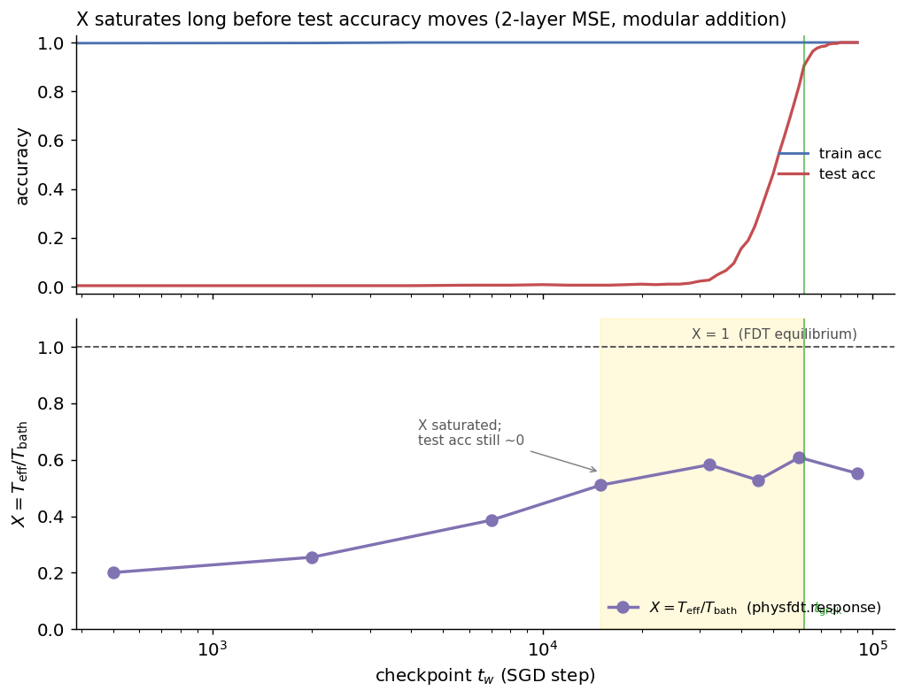

# physfdt

**Fluctuation–dissipation diagnostics for stochastic gradient descent.**

`physfdt` reads two fluctuation–dissipation observables off a training run, from
the optimiser's own arithmetic — no held-out validation split, no assumption
about the shape of the gradient noise:

- **`ρ`** — *has this run equilibrated at the current learning rate?* A cheap,
  per-step stationarity ratio that settles at `1` when further steps at that η
  buy nothing.
- **`X = T_eff/T_bath`** — *is this run on track to generalise?* An occasional,
  checkpoint-based fluctuation–dissipation ratio that, on the right loss,
  **saturates 3–5× before held-out accuracy moves** — a label-free *leading
  indicator* you can act on early. See [Forecasting a run](#forecasting-a-run-x-as-a-leading-indicator).

```python
from physfdt import FDRMonitor, FDRConfig, FDREquilibriumLR

monitor = FDRMonitor(optimizer, FDRConfig(half_life=500))
sched   = FDREquilibriumLR(optimizer, monitor, factor=0.5)

loss.backward()
with monitor.measure():
    optimizer.step()
sched.step()                      # decays the LR when rho settles at 1
```

---

## The relation

Any first-order optimiser can be written `w_{t+1} = w_t − η·u_t`, where `u_t` is
whatever direction it produces before the learning rate is applied. Take the
observable `O(w) = ½|w|²` and require its expectation to be stationary:

```
|w_{t+1}|² = |w_t|² − 2η ⟨w_t · u_t⟩ + η² ⟨|u_t|²⟩

  ⟹   2⟨w · u⟩ = η ⟨|u|²⟩                                          (FDR-1)
```

Define

```
ρ  =  2⟨w · u⟩ / (η ⟨|u|²⟩)
```

At stationarity `ρ = 1` exactly: the system has equilibrated at that η, and
further steps at that η buy nothing. (The converse needs care — see *Reading ρ*
below.) `physfdt` tracks `ρ` with exponentially smoothed numerator and denominator (a ratio of
averages, never an average of ratios) and reports when it settles.

For **plain SGD** (`u = g`) this is the fluctuation–dissipation relation of
Yaida, [arXiv:1810.00004](https://arxiv.org/abs/1810.00004): the left side is
dissipation, the right side is the second moment of the mini-batch gradient,
noise included. It assumes neither Gaussian nor isotropic noise — only
stationarity. That is what makes it different from effective-temperature
definitions that need a noise model.

For **other optimisers** the identity remains algebraically exact and is still a
valid stationarity diagnostic, but the fluctuation–dissipation reading is not
established. `physfdt` warns rather than hides this.

## Reading ρ

The same algebra gives an exact drift law, `E[Δ|w|²] = η²⟨|u|²⟩(1 − ρ)`. It
is tempting to read the norm's behaviour off the sign of `1 − ρ`. **Don't.**
ρ is a ratio whose denominator `η⟨|u|²⟩` can be tiny and dominated by a few
samples; measured on near-separable logistic regression with weight decay, ρ
was negative on 16,451 of 40,000 steps while `|w|` sat at 3.67 to three
decimals. So `physfdt` takes the verdict on the norm from `|w|²` directly — a
trend test over the last `4 × half_life` steps that must be both statistically
significant (`norm_z`) and physically non-negligible (`norm_rel_tol`, 0.5%) —
and uses ρ only for what it is good at: *given* a stationary norm, has the FDR
balance been reached.

| `regime` | meaning |
|---|---|
| `norm_growing` / `norm_shrinking` | `|w|²` is trending. Not equilibrated, whatever ρ says. |
| `equilibrated` | norm flat **and** `|ρ − 1| < tol` for `patience` steps |
| `stationary_noisy` | norm flat but ρ outside the band — ρ is too noisy at this `half_life`; compare `rho_std` with `tol` |
| `warming_up` | not enough history for a norm verdict yet |

### If the norm keeps growing

Two different situations produce a sustained `norm_growing`, and they need
opposite responses:

- **No weight decay, cross-entropy.** Once the data is separated, max-margin
  dynamics drives `|w| → ∞`
  ([Soudry et al., JMLR 2018](https://jmlr.org/papers/v19/18-188.html)). There
  is **no stationary state**; FDR-1 never applies. Add weight decay.
- **Weight decay present.** The equilibrium norm exists but has moved — for
  instance after a learning-rate decay, or when starting from a small
  initialisation. This is a transient. Train longer.

Measured on logistic regression over separable data, 40k steps:

| weight decay | \|w\| start → end | final ρ | |
|---|---|---|---|
| 0 | 0.46 → **11.07** | **−14294** | diverging, no stationary state |
| 1e-4 | 0.46 → 10.15 | −4614 | diverging |
| 1e-3 | 0.46 → 6.90 | 0.39 | not yet settled |
| **1e-2** | 0.46 → **3.67** | **1.07** | stationary |
| **5e-2** | 0.46 → **2.07** | **1.02** | stationary |

`physfdt` raises a one-time `RuntimeWarning` naming both causes once the norm
has grown for `nonstationary_patience` (default `4 × half_life`) steps.

### Check `tol` against the noise floor

ρ is an exponentially smoothed estimator, so it has sampling scatter of order
`1/√half_life`. If `tol` is below that scatter, `equilibrated` is being decided
by noise — and the detector typically never fires at all. Every state reports
its own measured noise floor:

```python
state.rho_std              # measured scatter of rho
state.tol_is_achievable    # False => tol is below 3 * rho_std
```

Measured on the solvable quadratic:

| `half_life` | `rho_std` | 3σ | `tol=0.05` usable? |
|---|---|---|---|
| 100 | 0.036 | 0.107 | no |
| 200 | 0.018 | 0.055 | no |
| 500 | 0.0077 | 0.023 | yes |
| 2000 | 0.0019 | 0.006 | yes |

The defaults (`half_life=500`, `tol=0.10`) are self-consistent by construction.
Badly conditioned problems need much more smoothing: near-separable
classification collapses most per-sample gradients, leaving `⟨|u|²⟩` small and
dominated by a few hard examples, and ρ can carry O(1) scatter there. Check
`tol_is_achievable` before believing `equilibrated`.

## Attribution

The FDR relations and the adaptive scheduler built on them are Yaida's, not
ours. This package exists to make them easy to measure and to reproduce, and to
pair them with the spectral observables (`α`, IPR) from
[Physica A **692** (2026) 131474](https://doi.org/10.1016/j.physa.2026.131474).
If you use the scheduler, cite Yaida.

---

## Install

```bash
pip install physfdt              # core, NumPy only
pip install "physfdt[torch]"     # + the PyTorch monitor and scheduler
```

From source:

```bash
git clone https://github.com/platalise/physfdt && cd physfdt
pip install -e ".[dev]"
pytest -q
```

The core has **no torch dependency**. `import physfdt` works in a NumPy-only
environment; the torch symbols are imported lazily.

## Validate it before you trust it

```bash
python examples/01_validate_quadratic.py
```

Runs SGD on `L(w) = ½ wᵀAw` with noisy gradients. That system is an
Ornstein–Uhlenbeck process whose stationary covariance provably satisfies FDR-1,
so `ρ → 1` is an exact prediction rather than a fit. Expected output:

```
     eta    mean rho (last 20k)        std   verdict
   0.005                 1.0002     0.0204   OK
   0.010                 1.0000     0.0119   OK
   0.020                 0.9999     0.0055   OK
   0.050                 1.0000     0.0024   OK
   0.100                 1.0000     0.0011   OK
```

Part 2 of the same script starts far from the minimum (`ρ ≈ 36`), watches the
detector fire four learning-rate cuts, and shows `ρ` returning to 1 after each.

## Monitor a real run

```bash
python examples/02_torch_quickstart.py                    # offline, synthetic
python examples/02_torch_quickstart.py --dataset mnist    # real data
python examples/02_torch_quickstart.py --schedule fdr     # detector drives the LR
```

Writes a CSV with one row per measured step: `rho`, both sides of FDR-1, the
learning rate, the loss, and the spectral exponent `α` of a probe layer.

## Benchmark it honestly

```bash
python examples/03_benchmark_arms.py --seeds 5
```

Four arms — constant, **tuned** cosine, ReduceLROnPlateau, FDR — on an identical
learning-rate tuning grid, with the monitor's overhead measured and subtracted.
The script prints three pre-registered failure criteria and the numbers needed
to check them. Read them before you read the result.

## A worked example: grokking

```bash
jupyter notebook examples/04_grokking_demo.ipynb
```

Does `ρ` know when a network has actually generalized? Trained a small MLP on
modular addition (the standard grokking benchmark) with plain SGD, watched
`ρ` throughout. Three seeds, all consistent, and **not** what a naive
"early-warning" framing would predict:

| | pre-transition (memorized, not generalized) | post-saturation (generalized) |
|---|---|---|
| median ρ | 1.59 – 1.78 | 0.97 – 1.01 |

`ρ` starts elevated and *relaxes down* to 1 once generalization completes —
opposite direction from "rises before the jump" — and it settles only
*after* test accuracy has already crossed 50% in every seed, sometimes after
90% of the final accuracy. So it doesn't warn of a coming jump; it confirms,
after the fact, that train accuracy saturating isn't the same thing as this
library calling the run stationary. n=3, one `p`, one architecture — read the
notebook's own caveats before reusing this.

`ρ` is the wrong observable for *forecasting* — but there is a right one.

---

## Forecasting a run: `X` as a leading indicator

`ρ` is a same-time ratio; it lags. The full fluctuation–dissipation ratio

```
X  =  T_eff / T_bath
```

does not. It compares the network's **response** to a small constant force
against its **fluctuations** in the same direction — the discrete-time,
mini-batch fluctuation–dissipation theorem. `T_bath` is the variance of the
mini-batch gradient projected onto a probe direction (the noise driving the
weights); `T_eff` is the temperature read off the trajectory itself, as the
slope of the mean-squared displacement `Δ(τ)` against twice the response `χ(τ)`
(equilibrium FDT: `Δ = 2·T·χ`). `X = 1` at equilibrium; `X` departs from 1 out
of it.

On the canonical grokking test-bed — a 2-layer network on modular addition with
an MSE readout — **`X` saturates long before held-out accuracy moves**:



```bash
python examples/05_leading_indicator.py       # ~5–10 min CPU, writes the figure
```

```python
from physfdt.response import fd_probe

s = fd_probe(model, X_train, y_train, loss_fn,   # loss_fn(model, xb, yb) -> loss
             eta=0.1, weight_decay=1e-3, batch_size=64)
print(s.X, s.T_eff, s.T_bath)                    # model is restored afterwards
```

`X` climbs from `~0.2` to a plateau of `~0.55` by `t_w ≈ 15 000`, while test
accuracy is still at chance and does not grok until `t_w ≈ 62 000` — a lead of
about **4×**, read from the training ramp alone with **no labels and no
validation set**. (The estimator matches the reference `X(t_w)` curve to within
0.01 at every checkpoint; the exact early value is Monte-Carlo-noisy, the *rise
and early saturation* are the robust, reproducible signal.)

### Why this saves trials, sweeps, and energy

A hyperparameter search is mostly a graveyard of runs that were never going to
generalise — but you don't find out until each one has burned its full
schedule. `X` gives an earlier, label-free verdict:

- **Kill-or-continue.** If `X` is climbing toward its plateau in the first
  ~20–30 % of a run, the run is on track — keep it. If `X` is flat or stalled,
  it is unlikely to generalise at these settings — kill it and change something,
  rather than paying for the rest of the schedule to confirm a failure.
- **Rank candidates early.** Across a sweep, the checkpoint at which `X`
  saturates orders runs by how soon they will generalise, before any of them
  has — so compute goes to the promising arms.
- **A stopping signal that isn't the loss.** Train loss and train accuracy
  saturate during the *memorisation* phase and say nothing about the
  generalisation still to come; `X` keeps moving through exactly that phase.

The saving is real because the probe is *occasional*: you pay for it at a
handful of checkpoints, not every step (cost below), and in return you can stop
paying for runs that a full validation curve would only condemn much later.

### Trust, and scope

The estimator is validated twice: against a closed-form multi-mode
Ornstein–Uhlenbeck system with a known `X` (`tests/test_response.py`, to within
Monte-Carlo error), and against the reference protocol of Nguyen (2026) on the
exact task above — it reproduces the published `X(t_w)` curve to **within 0.01
at every checkpoint**.

`X` is clean **where the probed loss is close to quadratic** — an MSE or
linearised readout, which is exactly the grokking construction above and the
regime the fluctuation–dissipation theory is derived in. It is **not** a
turn-key metric for every network:

- On a strongly non-quadratic, *saturating* loss — softmax cross-entropy once
  the network is confident — the gradient noise collapses, `T_bath → 0`, and `X`
  becomes numerically fragile and non-monotonic. In our own cross-entropy CNN
  runs `X` did **not** rise cleanly. Treat cross-entropy as out of scope until
  probed on a linearised (e.g. NTK/last-layer) readout.
- It assumes **plain SGD + weight decay** (`u = grad`, a confining term for a
  stationary state to exist). Momentum/Adam are out of scope for the FD reading.
- It is a **single-checkpoint, expensive** measurement (see cost below), not a
  per-step monitor like `ρ`.

Demonstrated on one task, one architecture, one modulus. The mechanism (the
Hessian spectrum flattening across the transition pulls `X` toward 1) is
understood, but the breadth of workloads it holds for is an open, empirical
question — the example exists so you can run it on yours.

---

## API

| | |
|---|---|
| `FDRConfig(half_life, tol, patience, min_steps)` | detector settings; defaults are self-consistent (see *Reading ρ*) |
| `state.regime`, `state.norm_trend`, `state.rho_std`, `state.tol_is_achievable` | is this measurement meaningful? |
| `FDRMonitor(optimizer, config, mode, every)` | torch monitor; `mode="delta"` (any optimiser) or `"grad"` (plain SGD, zero extra memory). Config timescales are in **optimiser** steps whatever `every` is. |
| `FDREquilibriumLR(optimizer, monitor, factor, min_lr)` | decay on equilibrium |
| `NumpyFDRMonitor(config)` | toy models and hand-written optimisers |
| `fd_probe(model, X, y, loss_fn, *, eta, weight_decay, batch_size, ...)` | twin-trajectory FD probe; returns `ResponseState(X, T_eff, T_bath, ...)`; restores the model afterwards |
| `spectral_report(W, method="mle"\|"window")` | `α`, its standard error, R², IPR |
| `TraceWriter(path, extra=[...])` | CSV trace, one row per measured step |

**`fd_probe` cost.** One call runs about `ndir·nseed·2·M + ML` extra
SGD-equivalent steps (defaults: `8·4·2·400 + 3000 ≈ 29 000`) and snapshots/
restores the model, so it is an *occasional, checkpoint-time* measurement, not a
per-step monitor. Lower `ndir`/`nseed`/`M` trade Monte-Carlo precision for speed.
It is orthogonal to `FDRMonitor`: `ρ` is your cheap per-step signal, `X` your
occasional forecast.

**Cost.** One pass over the parameters per measured step, plus one
parameter-sized buffer in `delta` mode. **Measured: at `every=1` the monitor took
~39% of wall clock** on a small MLP on CPU — the per-step tensor work is
comparable to the training step itself when the model is tiny. Use `every=20`
(the benchmark default) to amortise it to ~2%. If you are benchmarking
wall-clock or energy, keep the monitor on in the baseline arm too
(`--monitor-in-baseline`), or subtract it explicitly.

**Always `reset()` after a learning-rate change.** FDR-1 describes the stationary
state *at a given η*; mixing histories across learning rates is meaningless.
`FDREquilibriumLR` does this for you.

---

## Scope and limitations

Read this before putting a number in a paper.

- **It measures stationarity, not progress.** `ρ = 1` says the weight norm has
  stopped drifting at this η. It does not say the loss is low or that the model
  generalises.
- **Single-epoch pre-training is out of scope.** Large language models are
  trained under a fixed compute budget for roughly one pass, and stop because the
  budget ran out, not because they equilibrated. Such a run is never stationary
  and FDR-1 does not apply to it. The regime where this tool is useful is
  **multi-epoch fine-tuning on small data** — where runs do reach stationarity,
  and where a held-out split is expensive precisely because labelled data is
  scarce.
- **Momentum and Adam.** The identity holds; the physics does not transfer
  unchanged. Treat `ρ` as a stationarity diagnostic there, not as a measured
  effective temperature.
- **It has hyperparameters.** `tol`, `patience` and `half_life` are real choices,
  and they are *coupled*: `tol` must sit above the `1/√half_life` noise floor or
  the detector never fires. A method that needs them retuned per workload is not
  hyperparameter-free, and its net saving is smaller than a naive comparison
  suggests. This is failure criterion F2 in the benchmark script.
- **It needs a confining term.** Plain cross-entropy with no weight decay has no
  stationary state at all. See *Reading ρ* above.
- **Small `η` inflates the smoothing timescale.** After a decay, allow at least
  a few `half_life` before trusting `ρ` again. `min_steps` enforces a floor.
- **No claim of compute savings is made here.** Whether FDR-triggered decay beats
  a properly tuned cosine schedule is an empirical question that
  `examples/03_benchmark_arms.py` exists to settle, in either direction.
- **`X` (the forecasting probe) has its own, narrower scope.** It is clean on
  quadratic/MSE losses and numerically fragile on saturating cross-entropy; it
  assumes plain SGD + weight decay; and it is demonstrated on one task. Read
  [Forecasting a run → Trust, and scope](#trust-and-scope) before quoting an `X`.

## Tests

```bash
pytest -q          # 54 tests (9 need torch)
```

The physics tests are the ones that matter. `tests/test_validation_quadratic.py`
checks `ρ → 1` against a case with a closed-form answer, across five learning
rates, three noise magnitudes, and — the one that matters most — strongly
anisotropic noise, where model-based effective temperatures break down.
`tests/test_nonstationary_regime.py` pins the opposite case: that a run with no
stationary state is detected and named rather than silently mis-reported.

## Citing

If you use `X` (`physfdt.response.fd_probe`), or its validation against the
published `X(t_w)` curve, cite the paper it implements:

```bibtex
@article{nguyen2026fdtsgd,
  title   = {Fluctuation--dissipation violation as a spectral probe of
             learning in stochastic gradient descent},
  author  = {Nguyen, Quang},
  journal = {Physical Review Letters},
  note    = {under review},
  year    = {2026}
}
```

The paper's own reference code and data are archived separately on Zenodo:
[10.5281/zenodo.21267291](https://doi.org/10.5281/zenodo.21267291).

If you use the package itself (`ρ`, `FDRMonitor`, the spectral tools):

```bibtex
@software{physfdt,
  title  = {physfdt: fluctuation-dissipation diagnostics for SGD},
  author = {Nguyen, Quang},
  year   = {2026},
  url    = {https://github.com/platalise/physfdt}
}
```

Please also cite Yaida (arXiv:1810.00004) for the FDR relations and the
scheduler.

## Licence

MIT.
